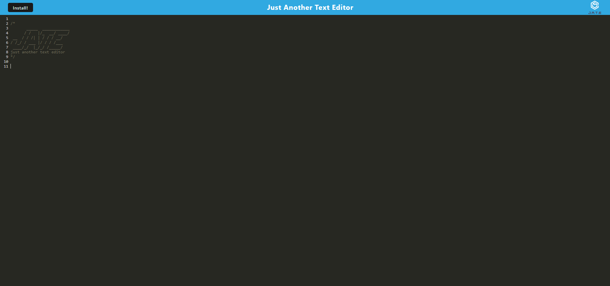
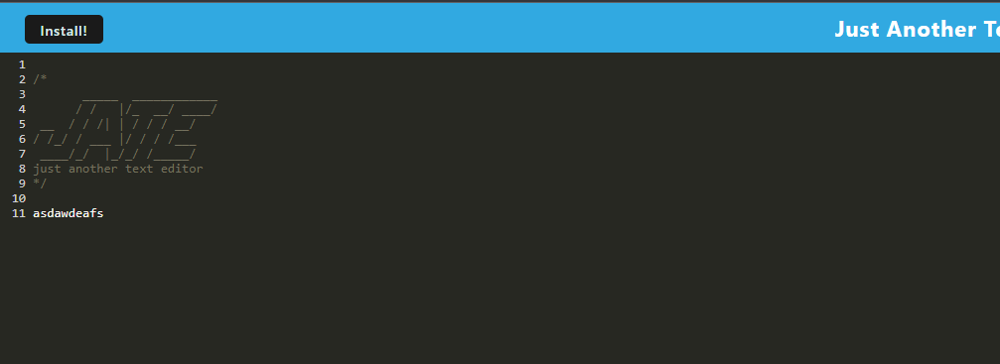
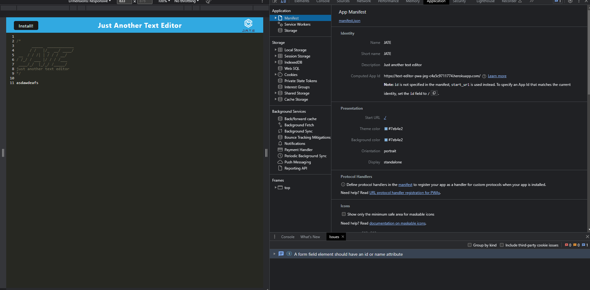
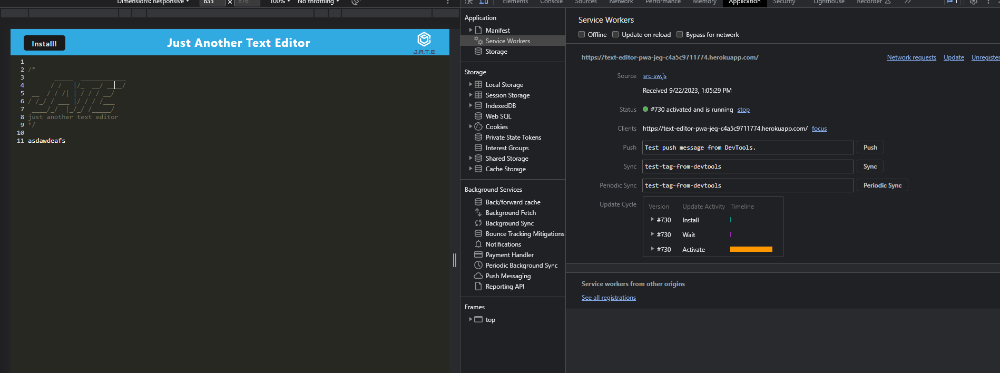
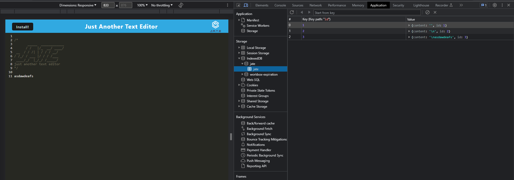

  # Text-Editor-PWA
  
  
  
    

  ## Table-of-Contents

  * [Description](#description)
  * [Installation](#installation)
  * [Usage](#usage)
  * [Tests](#tests)
  * [Questions](#questions)
  * [Screenshots](#screenshots)
  * [Deployment](#deployment)
  
  ## [Description](#table-of-contents)

  The application allows the user to write text online and offline which can also be installed.

  ## [Installation](#table-of-contents)

  To install the project clone the repo and run npm run install to get all dependencies 
  
  ## [License](#table-of-contents)

  The application is covered under the following license:

  
  [mit](https://choosealicense.com/licenses/mit)
    
  ## [Tests](#table-of-contents)

  In order to test app clone the repo install dependencies and run npm run install for dependencies. Once dependencies are installed run npm run start:dev

  ## [Screenshots](#screenshots)

  Main Starting Page

  

  App Functionality

  

  Manifest.json file

  

  Registered Service Worker

  

  IndexedDb Storage

  

  ## [Deployment](#deployment)

  https://text-editor-pwa-jeg-c4a5c9711774.herokuapp.com/

  ## [Questions](#table-of-contents)

  Please contact me using the following links:

  [GitHub](https://github.com/JoaquinGodina0)

  [Email: joaquingodina@icloud.com](mailto:joaquingodina@icloud.com)
